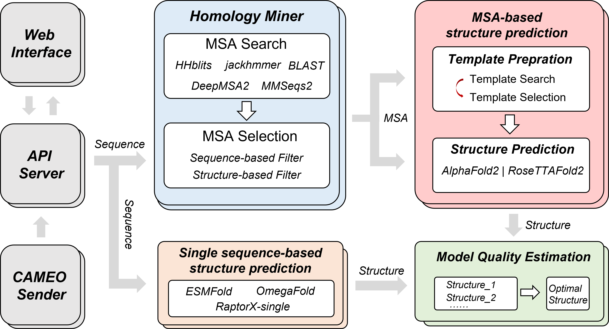

# AIRFold

**Features:**
- Implementation based on microservices architecture
- Launch all with one `docker-compose up`
- Services run in isolated docker container
- Submit tasks with RESTful API (FastAPI)
- Separated task queues and concurrence control
- Flower for monitoring the Celery tasks

## Introduction


AIRFold is an open-source platform for protein structure prediction.

## Quick Start

### Installation and running your first prediction

Please follow these steps:

1.  Install [Docker](https://www.docker.com/).
    *   Install
        [NVIDIA Container Toolkit](https://docs.nvidia.com/datacenter/cloud-native/container-toolkit/install-guide.html)
        for GPU support.
    *   Setup running
        [Docker as a non-root user](https://docs.docker.com/engine/install/linux-postinstall/#manage-docker-as-a-non-root-user).

2.  Clone this repository and `cd` into it.

    ```bash
    git clone https://github.com/health-air/AIRFold
    cd ./AIRFold
    docker-compose up
    ```

3.  Check the page:
    - Submit page: http://127.0.0.1
    - FastAPI page: http://127.0.0.1:8081/docs
    - Tasks monitor page (powered by [flower](https://github.com/mher/flower)): http://127.0.0.1:5555

*Note: please change IP address and ports accordingly, they are specified in `docker-compose.yml`*

### Databases for AIRFold
**Genomics and metagenomics sequence databases**

*   [BFD](https://bfd.mmseqs.com/),
*   [MGnify](https://www.ebi.ac.uk/metagenomics/),
*   [UniRef90](https://www.uniprot.org/help/uniref),
*   [NR database for BLAST](https://www.uniprot.org/help/uniref),
*   [Genomics and metagenomics sequence databases for DeepMSA2](https://zhanggroup.org/DeepMSA/download/),
*   [ColabFold dataset for MMseqs2](https://colabfold.mmseqs.com/),
*   [Small BFD sequence database](https://storage.googleapis.com/alphafold-databases/reduced_dbs/bfd-first_non_consensus_sequences.fasta.gz)
*   [Uniprot sequence database](https://zhanggroup.org/ftp/data/uniprot.zip)

**Structure databases**

*   [PDB70](http://wwwuser.gwdg.de/~compbiol/data/hhsuite/databases/hhsuite_dbs/),
*   [PDB (MMCIF format)](https://www.rcsb.org/)

**Data structure**

```tree
├── model_params (models and parameters for AlphaFold2, RoseTTAFold2, ect.)
├── bfd
├── blast_dbs
├── JGIclust
├── metaclust
├── mgnify
├── pdb70
├── pdb_mmcif
├── small_bfd
├── uniclust30
├── uniref30
└── uniref90
```


### Third-party tools

**MSA-based structure prediction**
*   [AlphaFold2](https://github.com/google-deepmind/alphafold)
*   [RoseTTAFold2](https://github.com/uw-ipd/RoseTTAFold2)

**Single sequence-based structure prediction**
*   [OmegaFold](https://github.com/HeliXonProtein/OmegaFold)
*   [ESMFold](https://github.com/facebookresearch/esm)
*   [RaptorX-Single](https://github.com/AndersJing/RaptorX-Single)

**Multiple sequence alignment generation**
*   [HH-suite3](https://github.com/soedinglab/hh-suite),
*   [jackhmmer](https://www.ebi.ac.uk/Tools/hmmer/search/jackhmmer)
*   [BLAST](https://blast.ncbi.nlm.nih.gov/Blast.cgi)
*   [DeepMSA2](https://zhanggroup.org/DeepMSA/download/)
*   [MMseq2](https://github.com/soedinglab/mmseqs2?tab=readme-ov-file)

**Multiple sequence alignment selection**
*   [PLMSearch](https://github.com/maovshao/PLMSearch)

**Protein model quality assessment**
*   [EnQA](https://github.com/BioinfoMachineLearning/EnQA)
*   [QATEN](https://github.com/CQ-zhang-2016/QATEN)


## Command for different functions

### Multiple sequence alignment generation
```bash
# Input: Protein sequences in fasta format.
# Output: Multiple sequence alignment results in a3m format.
python run_mode.py --input_path example.fasta --mode msa
```
### Pretrained embedding generation

```bash
# Input: Protein sequences in fasta format.
# Output: Generated sequence embeddings in pickle format.
python run_mode.py --input_path example.fasta --mode feature
```
### Protein contact map prediction

```bash
# Input: Protein sequences in fasta format.
# Output: Generated contact map in pickle format.
python run_mode.py --input_path example.fasta --mode disgram
```

### Protein structure prediction

```bash
# Input: Protein sequences in fasta format.
# Output: Protein structure in pdb format.
python run_mode.py --input_path example.fasta --mode pipline
```


## Citation

If you find our open-sourced code & models helpful to your research, please also consider star🌟 and cite📑 this repo. Thank you for your support!
```
@misc{AIRFold_code,
  author={Hongliang, Li and Xin, Hong and Yanyan, Lan},
  title={Code of AIRFold},
  year={2024},
  howpublished = {\url{https://github.com/health-air/AIRFold}}
}
```
I also recommended that you reference the third-party tools (listed above) you use.


## License and Disclaimer

Copyright 2024 health-air.

Extended from AlphaFold, OpenComplex is licensed under
the permissive Apache Licence, Version 2.0.

## Contributing

If you encounter problems using AIRFold, feel free to create an issue! We also
welcome pull requests from the community.

## Contact Information
For help or issues using the repos, please submit a GitHub issue.

For other communications, please contact Yanyan Lan (lanyanyan@air.tsinghua.edu.cn).
