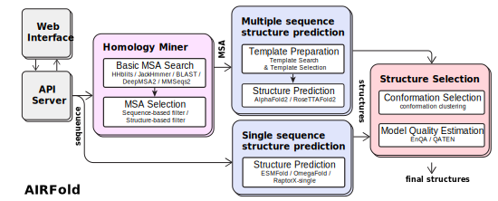
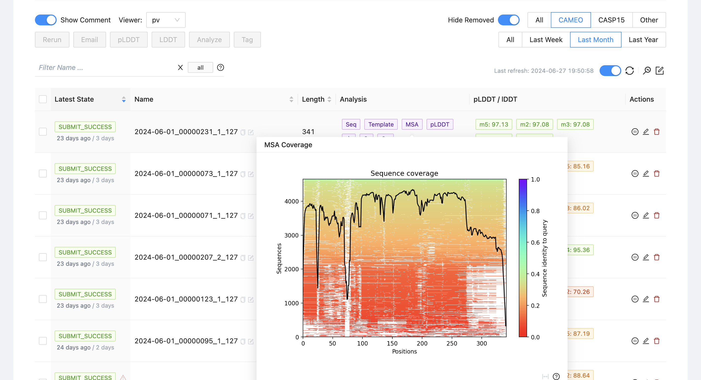

# AIRFold

AIRFold, built on the foundation of AlphaFold2, aims to provide scalable, systematic solutions for the critical issue of protein structure prediction in the field of life sciences. AIRFold's unique *Homology Miner* module focuses on the mining and extraction of co-evolutionary information, intelligently and automatically extracting, analyzing, and processing the co-evolution information within protein homologous sequences (MSA). In addition, AIRFold offers a systematic structural prediction solution, integrating various leading structural prediction models such as AlphaFold2, RoseTTAFold2, single-sequence structure models like OmegaFold and ESMFold, and ultimately ranking and screening all predicted structures using a model quality estimation (MQE) module. To fully integrate these different modules, we provide a microservices architecture along with user-friendly APIs and a web-based graphical interface, making it convenient for developers and biochemical researchers to use our platform for structural prediction.

<p align="center">

</p>


## Quick Start


AIRFold adopts a microservices architecture and uses Docker to manage all modules and their respective runtime environments, making deployment and startup of AIRFold very simple. Additionally, AIRFold provides an easy-to-use web interface and API, allowing users to submit and manage structure prediction requests conveniently. Follow the steps provided in the documentation below to quickly deploy AIRFold and start your structure prediction journey.


AIRFold Framework             |  AIRFold Web Interface
:-------------------------:|:-------------------------:
 | 


### Installation and running your first prediction

Please follow these steps:

1.  Install [Docker](https://www.docker.com/).
    *   Install
        [NVIDIA Container Toolkit](https://docs.nvidia.com/datacenter/cloud-native/container-toolkit/install-guide.html)
        for GPU support.
    *   Setup running
        [Docker as a non-root user](https://docs.docker.com/engine/install/linux-postinstall/#manage-docker-as-a-non-root-user).

2.  Clone AIRFold repository:

    ```bash
    git clone https://github.com/health-air/AIRFold
    cd ./AIRFold
    ```

3. Download and prepare the databases, see [Databases](#databases) section.


4. Launch AIRFold via one line command:

    ```bash
    docker-compose up
    ```

5.  Interact with AIRFold via Web page or RESTful API:
    - Submit page: http://127.0.0.1
    - API document page: http://127.0.0.1:8081/docs
    - Tasks monitor page: http://127.0.0.1:5555

*Note: please change IP address and ports accordingly, they are specified in `docker-compose.yml`*

### Databases

AIRFold searches for MSA and templates from various databases. The following lists all the databases used.

**Genomics and metagenomics sequence databases**

*   [BFD](https://bfd.mmseqs.com/),
*   [MGnify](https://www.ebi.ac.uk/metagenomics/),
*   [UniRef90](https://www.uniprot.org/help/uniref),
*   [NR database for BLAST](https://www.uniprot.org/help/uniref),
*   [Genomics and metagenomics sequence databases for DeepMSA2](https://zhanggroup.org/DeepMSA/download/),
*   [ColabFold dataset for MMseqs2](https://colabfold.mmseqs.com/),
*   [Small BFD sequence database](https://storage.googleapis.com/alphafold-databases/reduced_dbs/bfd-first_non_consensus_sequences.fasta.gz)
*   [Uniprot sequence database](https://zhanggroup.org/ftp/data/uniprot.zip)

**Structure databases**

*   [PDB70](http://wwwuser.gwdg.de/~compbiol/data/hhsuite/databases/hhsuite_dbs/),
*   [PDB (MMCIF format)](https://www.rcsb.org/)

**Data structure**

```tree
├── model_params (models and parameters for AlphaFold2, RoseTTAFold2, ect.)
├── bfd
├── blast_dbs
├── JGIclust
├── metaclust
├── mgnify
├── pdb70
├── pdb_mmcif
├── small_bfd
├── uniclust30
├── uniref30
└── uniref90
```

### Third-party tools used in AIRFold

**MSA-based structure prediction**
*   [AlphaFold2](https://github.com/google-deepmind/alphafold)
*   [RoseTTAFold2](https://github.com/uw-ipd/RoseTTAFold2)

**Single sequence-based structure prediction**
*   [OmegaFold](https://github.com/HeliXonProtein/OmegaFold)
*   [ESMFold](https://github.com/facebookresearch/esm)
*   [RaptorX-Single](https://github.com/AndersJing/RaptorX-Single)

**Multiple sequence alignment generation**
*   [HH-suite3](https://github.com/soedinglab/hh-suite),
*   [jackhmmer](https://www.ebi.ac.uk/Tools/hmmer/search/jackhmmer)
*   [BLAST](https://blast.ncbi.nlm.nih.gov/Blast.cgi)
*   [DeepMSA2](https://zhanggroup.org/DeepMSA/download/)
*   [MMseq2](https://github.com/soedinglab/mmseqs2?tab=readme-ov-file)

**Multiple sequence alignment selection**
*   [PLMSearch](https://github.com/maovshao/PLMSearch)

**Protein model quality assessment**
*   [EnQA](https://github.com/BioinfoMachineLearning/EnQA)


## Quick commands for main functions

In addition to the web interface and API, AIRFold also provides convenient scripts for the following four functions: multiple sequence alignment generation, pretrained embedding generation, protein contact map prediction, and protein structure prediction.


### Multiple sequence alignment generation

- **Input:** Protein sequences in fasta format.
- **Output**: Multiple sequence alignment results in a3m format.

    ```bash
    python run_mode.py --input_path example.fasta --mode msa
    ```

### Pretrained embedding generation

- **Input:** Protein sequences in fasta format.
- **Output:** Generated sequence embeddings in pickle format.

    ```bash
    python run_mode.py --input_path example.fasta --mode feature
    ```

### Protein contact map prediction

- **Input:** Protein sequences in fasta format.
- **Output:** Generated contact map in pickle format.

    ```bash
    python run_mode.py --input_path example.fasta --mode disgram
    ```

### Protein structure prediction

- **Input:** Protein sequences in fasta format.
- **Output:** Protein structure in pdb format.

    ```bash
    python run_mode.py --input_path example.fasta --mode pipline
    ```


## Citing this work

If you find our open-sourced code & models helpful to your research, please also consider star🌟 and cite📑 this repo. Thank you for your support!
```
@misc{airfold,
  author={Xin, Hong and Hongliang, Li and Jingjing, Gong and Yuxuan, Song, and Yinjun, Jia and Keyue, Qiu and Han, Tang and Haichuan, Tan and Yanyan, Lan},
  title={AIRFold},
  year={2024},
  howpublished = {\url{https://github.com/health-air/AIRFold}}
}
```
Please also reference the third-party tools (listed above) you use.

## Acknowledgements

We gratefully acknowledge the financial support provided by the National Key R&D Program of China under the grant No.2021YFF1201600. This support has been crucial in enabling our research and development activities.


## License and Disclaimer

Copyright 2024 AIR.

AIRFold is extended from AlphaFold, and is licensed under the permissive Apache Licence, Version 2.0.

## Contributing

If you encounter problems using AIRFold, feel free to create an issue! We also
welcome pull requests from the community.

## Contact Information

For help or issues using the repos, please submit a GitHub issue.

For other communications, please contact Yanyan Lan (lanyanyan@air.tsinghua.edu.cn).
